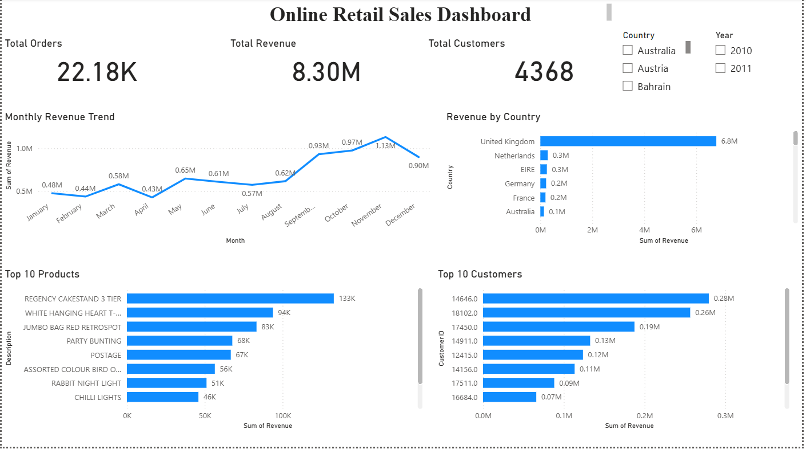

# 📊 Online Retail Sales Dashboard (Power BI)

## 📌 Project Overview
This project presents an interactive Power BI dashboard built using an online retail dataset.  
The dashboard provides insights into sales performance, customer behavior, and product trends.

---

## 🎯 Objectives
- Analyze monthly revenue trends
- Identify top-performing products
- Find high-value customers
- Understand revenue distribution across countries

---

## 📊 Dashboard Features
- 📈 Monthly Revenue Trend (Line Chart)
- 🌍 Revenue by Country (Bar Chart)
- 🏆 Top 10 Products by Revenue
- 👥 Top 10 Customers by Revenue
- 🔢 KPI Cards:
  - Total Orders
  - Total Revenue
  - Total Customers

---

## 🧹 Data Cleaning
- Removed null/undefined values
- Fixed column headers
- Created Revenue column (Quantity × UnitPrice)
- Extracted Month from InvoiceDate

---

## 🛠 Tools Used
- Power BI
- Excel / CSV Dataset

---

## 📷 Dashboard Preview

---

## 📌 Key Insights
- Revenue shows growth towards the end of the year 📈
- Few customers contribute significantly to total revenue
- Certain products dominate sales consistently
- United Kingdom contributes highest revenue

---

## 🚀 Conclusion
This dashboard helps in understanding business performance and supports data-driven decision making.

---

## 👩‍💻 Author
**Sanjana Kucharlapati**
